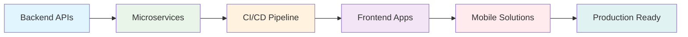

# 👋 Welcome to My GitLab Profile!

<div align="center">
  
</div>

---

## 🚀 About Me

**Software Developer @ GTBank Uganda** | **Microservices Migration Lead**

I'm a passionate full-stack developer with 3+ years of experience crafting robust backend APIs and dynamic frontend applications. Currently leading the transformation of monolithic banking systems into scalable microservices architecture at GT Bank Uganda.

- 🏦 **Current Role**: Software Developer at GT Bank Uganda
- 🔄 **Leading Initiative**: Co-leading migration from monolithic to microservices architecture
- 💼 **Experience**: 3+ years in full-stack development
- 🌍 **Location**: Kampala, Uganda
- 🎯 **Focus**: Building scalable, maintainable, and secure financial applications

---

## 💻 Technical Expertise

### 🔧 Backend Development
```yaml
Primary Stack:
  - .NET Core / C# (3+ years)
  - RESTful API Development
  - Microservices Architecture
  - Database Design & Optimization
  
DevOps & CI/CD:
  - GitLab CI/CD Pipelines
  - Docker & Containerization
  - Azure DevOps
  - Infrastructure as Code
```

### 🎨 Frontend Development
```yaml
Frameworks & Libraries:
  - React.js (SPA Development)
  - React Native (Mobile Apps)
  - Angular (Enterprise Applications)
  - Ionic (Cross-platform Mobile)
  
Technologies:
  - TypeScript/JavaScript
  - HTML5 & CSS3
  - State Management (Redux, NgRx)
  - Responsive Design
```

---

## 🏗️ Architecture & Design Patterns

<div align="center">

| **Microservices** | **API Design** | **DevOps** |
|:-----------------:|:--------------:|:----------:|
| Service Decomposition | RESTful APIs | GitLab CI/CD |
| Domain-Driven Design | API Gateway | Docker |
| Event-Driven Architecture | Authentication & Authorization | Monitoring |
| Container Orchestration | Rate Limiting | Infrastructure Automation |

</div>

---

## 🛠️ Technology Stack

<div align="center">

### **Backend Technologies**


### **Frontend Technologies**


### **DevOps & Tools**


</div>

---

## 🎯 Current Focus

### 🏗️ **Microservices Migration Project**
Leading the architectural transformation of GT Bank Uganda's core banking systems:

- **Challenge**: Decomposing monolithic applications into scalable microservices
- **Approach**: Domain-driven design principles and event-driven architecture
- **Technologies**: .NET Core, Docker, GitLab CI/CD, Azure
- **Impact**: Improved scalability, maintainability, and deployment flexibility

### 📈 **Key Achievements**
- Successfully migrated 5+ core banking modules to microservices
- Implemented automated CI/CD pipelines reducing deployment time by 70%
- Designed and developed 15+ RESTful APIs serving 10,000+ daily transactions
- Built responsive web applications serving 500+ concurrent users

---

## 🌟 Professional Highlights



---

## 📊 Development Philosophy

> **"Clean Code, Scalable Architecture, Continuous Delivery"**

- 🧹 **Clean Code**: Following SOLID principles and best practices
- 🏗️ **Scalable Design**: Building systems that grow with business needs
- 🚀 **DevOps Culture**: Embracing automation and continuous improvement
- 🔒 **Security First**: Implementing secure coding practices in financial systems
- 📈 **Performance Focused**: Optimizing for speed and efficiency

---

## 🤝 Let's Connect!

I'm always excited to discuss technology, share knowledge, and explore collaboration opportunities!

<div align="center">

[](https://www.linkedin.com/in/kigozi-joseph-suubi-19073a198/)
[](https://twitter.com/richards_zeph)
[](mailto:your.email@example.com)

</div>

---

<div align="center">
  
</div>

<div align="center">
  <i>"Building the future of banking, one microservice at a time." 💙</i>
</div>
